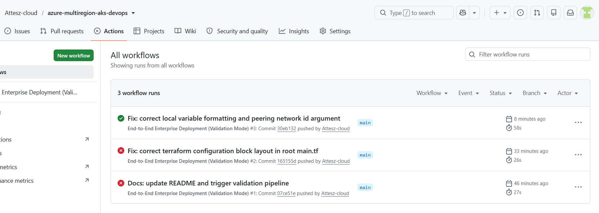
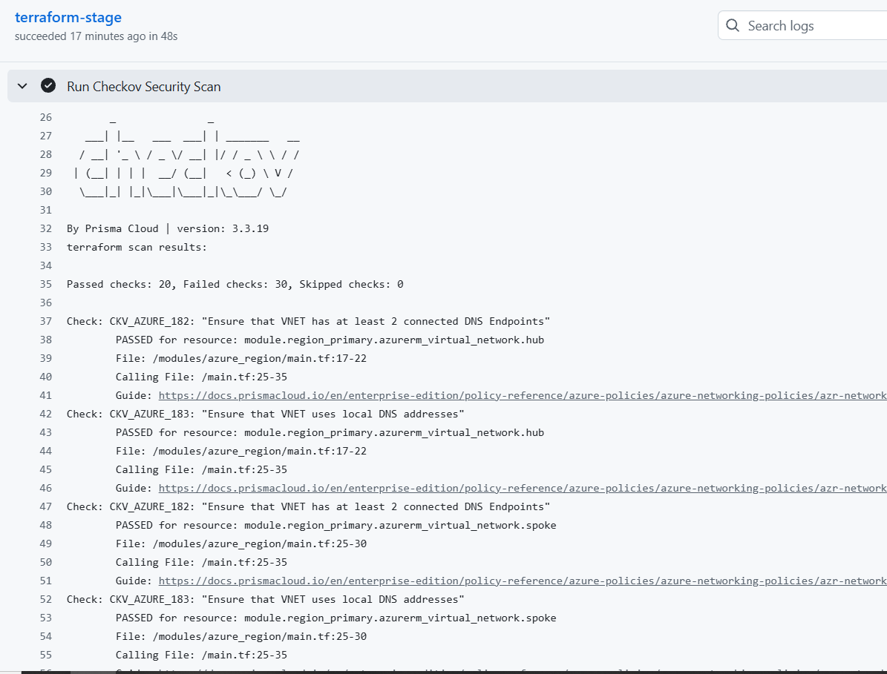

# Azure Multi-Region Hub-and-Spoke Infrastructure with AKS

## Project Overview
This repo contains a multi-region deployment setup in Azure using Terraform and GitHub Actions. The goal was to build a highly available architecture following Microsoft best practices (AZ-400 blueprint), focusing on Infrastructure as Code (IaC) and pre-deployment validation pipelines.

---

## Architecture and Design
The network topology is based on a global Hub-and-Spoke design across two separate Azure regions for disaster recovery.

### Network Components
1. **Primary Region (West Europe):** Contains a Hub VNet, a Spoke VNet, and the production AKS cluster.
2. **Secondary Region (North Europe):** A replica setup of the primary region for failover.
3. **Global Peering:** Connects the two Hub VNets to link the regions together.
4. **Local Peering:** Connects Hub and Spoke within the same region.
5. **Monitoring:** Log Analytics Workspaces are connected to both AKS clusters for log collection.

---

## Directory Structure
```text
├── .github/workflows/
│   └── deploy.yaml           # GitHub Actions validation pipeline
├── modules/azure_region/
│   ├── main.tf               # Regional module (VNet, Subnet, AKS, Log Analytics)
│   ├── variables.tf
│   └── outputs.tf
├── main.tf                       # Main configuration (calls the module twice)
├── deployment.yaml               # Kubernetes deployment
├── service.yaml                  # Kubernetes service
├── hpa.yaml                      # Horizontal Pod Autoscaler
└── README.md
```

---

## CI/CD Pipeline Workflow
Since I am running this without active cloud credits, I configured the GitHub Actions workflow to run as a strict **Validation Pipeline**. It tests everything end-to-end without spinning up actual resources in Azure.

### What the pipeline checks:
* **Terraform formatting:** Runs `terraform fmt` to keep the code clean.
* **Syntax validation:** Runs `terraform validate` to make sure there are no typos.
* **Security analysis:** Uses **Checkov** to scan the Terraform files for security risks before deployment.
* **Kubernetes sanity check:** A quick Python script validates that the YAML files are structurally sound.

---

## Execution Proofs and Logs

### 1. Successful Pipeline Run


### 2. Checkov Static Code Analysis
